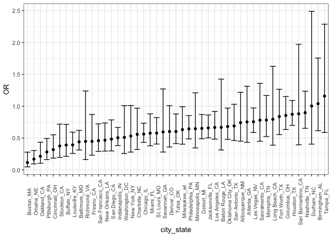
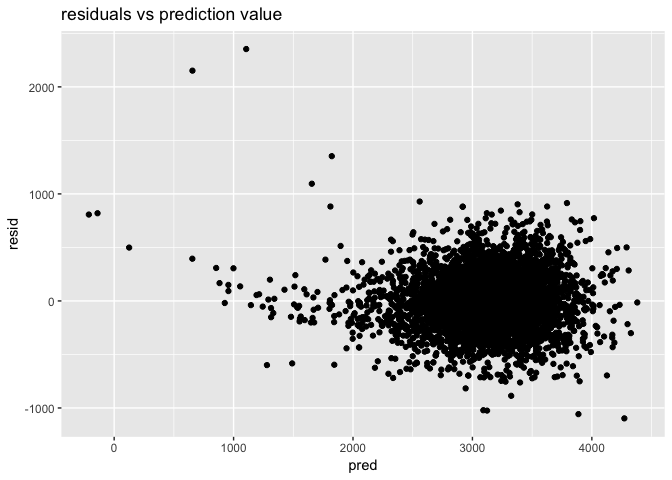

p8105\_hw6\_hn2339
================
Haowei Ni
2018/11/18

``` r
library(tidyverse)
```

    ## ─ Attaching packages ──────────────────── tidyverse 1.2.1 ─

    ## ✔ ggplot2 3.0.0     ✔ purrr   0.2.5
    ## ✔ tibble  1.4.2     ✔ dplyr   0.7.8
    ## ✔ tidyr   0.8.1     ✔ stringr 1.3.1
    ## ✔ readr   1.1.1     ✔ forcats 0.3.0

    ## ─ Conflicts ───────────────────── tidyverse_conflicts() ─
    ## ✖ dplyr::filter() masks stats::filter()
    ## ✖ dplyr::lag()    masks stats::lag()

``` r
library(dplyr)
library(stringr)
library(readr)
library(leaps)
library(modelr)
library(mgcv)
```

    ## Loading required package: nlme

    ## 
    ## Attaching package: 'nlme'

    ## The following object is masked from 'package:dplyr':
    ## 
    ##     collapse

    ## This is mgcv 1.8-25. For overview type 'help("mgcv-package")'.

``` r
library(broom)
```

    ## 
    ## Attaching package: 'broom'

    ## The following object is masked from 'package:modelr':
    ## 
    ##     bootstrap

Question 1
----------

``` r
library(readr)
homicide = read_csv("data/homicide-data.csv") %>% 
  janitor::clean_names()
```

    ## Parsed with column specification:
    ## cols(
    ##   uid = col_character(),
    ##   reported_date = col_integer(),
    ##   victim_last = col_character(),
    ##   victim_first = col_character(),
    ##   victim_race = col_character(),
    ##   victim_age = col_character(),
    ##   victim_sex = col_character(),
    ##   city = col_character(),
    ##   state = col_character(),
    ##   lat = col_double(),
    ##   lon = col_double(),
    ##   disposition = col_character()
    ## )

Create a city\_state variable and a binary variable

``` r
homicide = 
  homicide %>% 
  mutate(city_state = str_c(city, state, sep = "_"),  
         resolved = as.numeric(disposition == "Closed by arrest"))
```

Omit city Dallas, TX; Phoenix, AZ; and Kansas City, MO and Tulsa, AL

``` r
homicide = 
  homicide %>% 
  filter(!(city_state == "Dallas_TX" | city_state == "Phoenix_AZ" | city_state == "Kansas City_MO" | city_state == "Tulsa_AL")) %>% 
  mutate(victim_race = fct_relevel(ifelse(victim_race == "White", "white", "non-white"), "white"))
```

Modifiy victim\_race, and make victim\_age numeric

``` r
homicide = 
  homicide %>%
  mutate(victim_age = as.numeric(victim_age),
         victim_race = fct_relevel(victim_race, "White"))
```

    ## Warning in evalq(as.numeric(victim_age), <environment>): 强制改变过程中产生
    ## 了NA

    ## Warning: Unknown levels in `f`: White

fit a logistic regression

``` r
baltimore_df = 
  homicide %>% 
  filter(city == "Baltimore")
```

``` r
fit_logistic = 
  baltimore_df %>% 
  glm(resolved ~ victim_age + victim_race + victim_sex, data = ., family = binomial())
```

obtain the estimate and confidence interval of the adjusted odds ratio

``` r
fit_logistic %>% 
  broom::tidy() %>% 
  mutate(OR = exp(estimate), # transform back
         lower_bound = exp(estimate - std.error*1.96),
         upper_bound = exp(estimate + std.error*1.96)) %>%
  select(term, log_OR = estimate, OR, lower_bound, upper_bound, p.value) %>% 
  knitr::kable(digits = 3)
```

| term                  |  log\_OR|     OR|  lower\_bound|  upper\_bound|  p.value|
|:----------------------|--------:|------:|-------------:|-------------:|--------:|
| (Intercept)           |    1.186|  3.274|         2.067|         5.186|    0.000|
| victim\_age           |   -0.007|  0.993|         0.987|         0.999|    0.032|
| victim\_racenon-white |   -0.820|  0.441|         0.313|         0.620|    0.000|
| victim\_sexMale       |   -0.888|  0.412|         0.315|         0.537|    0.000|

the odds ratio estimate is 0.441 and 95% CI is (0.313, 0.620)

``` r
homicide_all =
  homicide %>% 
  group_by(city_state) %>% 
  nest()
OR_plot =
  homicide_all %>% 
  mutate(models = map(data, ~glm(resolved ~ victim_age + victim_sex + victim_race, data = .x, family = binomial())),
    models = map(models, broom::tidy)) %>% 
  select(-data) %>% 
  unnest() %>% 
  filter(term == "victim_racenon-white") %>% 
  mutate(OR = exp(estimate),
         lower_bound = exp(estimate - std.error*1.96),
         upper_bound = exp(estimate + std.error*1.96)) 
```

``` r
OR_plot %>% 
  mutate(city_state = fct_reorder(city_state, OR)) %>% 
  ggplot(aes(x = city_state, y = OR)) + 
  geom_point() + 
  geom_errorbar(aes(ymin = lower_bound, ymax = upper_bound)) +
  theme_bw() +
  theme(legend.position = "bottom",
        legend.direction = "horizontal",
        axis.text.x = element_text(angle = 90, size = 8),
        legend.key.size = unit(0.05, "cm"))
```



From this plot, we can see that Boston\_MA has the lowest OR means that the non-white people's case and the white people's case are the same level difficulty to resolve.Tampa\_FL has the highest OR means that non-white people's cases are much in the same solving rate as the white people. There are no much difference. Some cities have large error bar means that the there are much influction in the rate of solving the cases.

Question 2
----------

load and clean data.

``` r
birthweight = read_csv("data/birthweight.csv") %>% 
  mutate(mrace = as.factor(mrace),
         frace = as.factor(frace),
         babysex = as.factor(babysex),
         malform = as.factor(malform))
```

    ## Parsed with column specification:
    ## cols(
    ##   .default = col_integer(),
    ##   gaweeks = col_double(),
    ##   ppbmi = col_double(),
    ##   smoken = col_double()
    ## )

    ## See spec(...) for full column specifications.

In order to find the best fitted model, we need to compare the adjusted R^2. We can use the "lm.regsubsets" function.

``` r
model = regsubsets(bwt ~ ., data = birthweight)
```

    ## Warning in leaps.setup(x, y, wt = wt, nbest = nbest, nvmax = nvmax,
    ## force.in = force.in, : 3 linear dependencies found

    ## Reordering variables and trying again:

``` r
summary(model)
```

    ## Subset selection object
    ## Call: regsubsets.formula(bwt ~ ., data = birthweight)
    ## 24 Variables  (and intercept)
    ##          Forced in Forced out
    ## babysex2     FALSE      FALSE
    ## bhead        FALSE      FALSE
    ## blength      FALSE      FALSE
    ## delwt        FALSE      FALSE
    ## fincome      FALSE      FALSE
    ## frace2       FALSE      FALSE
    ## frace3       FALSE      FALSE
    ## frace4       FALSE      FALSE
    ## frace8       FALSE      FALSE
    ## gaweeks      FALSE      FALSE
    ## malform1     FALSE      FALSE
    ## menarche     FALSE      FALSE
    ## mheight      FALSE      FALSE
    ## momage       FALSE      FALSE
    ## mrace2       FALSE      FALSE
    ## mrace3       FALSE      FALSE
    ## mrace4       FALSE      FALSE
    ## parity       FALSE      FALSE
    ## ppbmi        FALSE      FALSE
    ## ppwt         FALSE      FALSE
    ## smoken       FALSE      FALSE
    ## pnumlbw      FALSE      FALSE
    ## pnumsga      FALSE      FALSE
    ## wtgain       FALSE      FALSE
    ## 1 subsets of each size up to 9
    ## Selection Algorithm: exhaustive
    ##          babysex2 bhead blength delwt fincome frace2 frace3 frace4 frace8
    ## 1  ( 1 ) " "      "*"   " "     " "   " "     " "    " "    " "    " "   
    ## 2  ( 1 ) " "      "*"   "*"     " "   " "     " "    " "    " "    " "   
    ## 3  ( 1 ) " "      "*"   "*"     " "   " "     " "    " "    " "    " "   
    ## 4  ( 1 ) " "      "*"   "*"     "*"   " "     " "    " "    " "    " "   
    ## 5  ( 1 ) " "      "*"   "*"     "*"   " "     " "    " "    " "    " "   
    ## 6  ( 1 ) " "      "*"   "*"     "*"   " "     " "    " "    " "    " "   
    ## 7  ( 1 ) " "      "*"   "*"     "*"   " "     " "    " "    " "    " "   
    ## 8  ( 1 ) " "      "*"   "*"     "*"   " "     " "    " "    "*"    " "   
    ## 9  ( 1 ) "*"      "*"   "*"     "*"   " "     " "    " "    "*"    " "   
    ##          gaweeks malform1 menarche mheight momage mrace2 mrace3 mrace4
    ## 1  ( 1 ) " "     " "      " "      " "     " "    " "    " "    " "   
    ## 2  ( 1 ) " "     " "      " "      " "     " "    " "    " "    " "   
    ## 3  ( 1 ) " "     " "      " "      " "     " "    "*"    " "    " "   
    ## 4  ( 1 ) " "     " "      " "      " "     " "    "*"    " "    " "   
    ## 5  ( 1 ) "*"     " "      " "      " "     " "    "*"    " "    " "   
    ## 6  ( 1 ) "*"     " "      " "      " "     " "    "*"    " "    " "   
    ## 7  ( 1 ) "*"     " "      " "      " "     " "    "*"    " "    " "   
    ## 8  ( 1 ) "*"     " "      " "      " "     " "    "*"    " "    " "   
    ## 9  ( 1 ) "*"     " "      " "      " "     " "    "*"    " "    " "   
    ##          parity pnumlbw pnumsga ppbmi ppwt smoken wtgain
    ## 1  ( 1 ) " "    " "     " "     " "   " "  " "    " "   
    ## 2  ( 1 ) " "    " "     " "     " "   " "  " "    " "   
    ## 3  ( 1 ) " "    " "     " "     " "   " "  " "    " "   
    ## 4  ( 1 ) " "    " "     " "     " "   " "  " "    " "   
    ## 5  ( 1 ) " "    " "     " "     " "   " "  " "    " "   
    ## 6  ( 1 ) " "    " "     " "     " "   " "  "*"    " "   
    ## 7  ( 1 ) " "    " "     " "     "*"   " "  "*"    " "   
    ## 8  ( 1 ) " "    " "     " "     "*"   " "  "*"    " "   
    ## 9  ( 1 ) " "    " "     " "     "*"   " "  "*"    " "

The '\*' means that correlation is significant, so we need to include this variable in the model. So for the best fitted model, we choose 'babysex', 'bhead', 'blength', 'delwt', 'frace4', 'gaweeks', 'mrace2', 'ppbmi', 'smoken'.

``` r
fit_full = lm(bwt~., data = birthweight)
step(fit_full, direction = "backward")
```

    ## Start:  AIC=48717.83
    ## bwt ~ babysex + bhead + blength + delwt + fincome + frace + gaweeks + 
    ##     malform + menarche + mheight + momage + mrace + parity + 
    ##     pnumlbw + pnumsga + ppbmi + ppwt + smoken + wtgain
    ## 
    ## 
    ## Step:  AIC=48717.83
    ## bwt ~ babysex + bhead + blength + delwt + fincome + frace + gaweeks + 
    ##     malform + menarche + mheight + momage + mrace + parity + 
    ##     pnumlbw + pnumsga + ppbmi + ppwt + smoken
    ## 
    ## 
    ## Step:  AIC=48717.83
    ## bwt ~ babysex + bhead + blength + delwt + fincome + frace + gaweeks + 
    ##     malform + menarche + mheight + momage + mrace + parity + 
    ##     pnumlbw + ppbmi + ppwt + smoken
    ## 
    ## 
    ## Step:  AIC=48717.83
    ## bwt ~ babysex + bhead + blength + delwt + fincome + frace + gaweeks + 
    ##     malform + menarche + mheight + momage + mrace + parity + 
    ##     ppbmi + ppwt + smoken
    ## 
    ##            Df Sum of Sq       RSS   AIC
    ## - frace     4    124365 320848704 48712
    ## - malform   1      1419 320725757 48716
    ## - ppbmi     1      6346 320730684 48716
    ## - momage    1     28661 320752999 48716
    ## - mheight   1     66886 320791224 48717
    ## - menarche  1    111679 320836018 48717
    ## - ppwt      1    131132 320855470 48718
    ## <none>                  320724338 48718
    ## - fincome   1    193454 320917792 48718
    ## - parity    1    413584 321137922 48721
    ## - mrace     3    868321 321592659 48724
    ## - babysex   1    853796 321578134 48727
    ## - gaweeks   1   4611823 325336161 48778
    ## - smoken    1   5076393 325800732 48784
    ## - delwt     1   8008891 328733230 48823
    ## - blength   1 102050296 422774634 49915
    ## - bhead     1 106535716 427260054 49961
    ## 
    ## Step:  AIC=48711.51
    ## bwt ~ babysex + bhead + blength + delwt + fincome + gaweeks + 
    ##     malform + menarche + mheight + momage + mrace + parity + 
    ##     ppbmi + ppwt + smoken
    ## 
    ##            Df Sum of Sq       RSS   AIC
    ## - malform   1      1447 320850151 48710
    ## - ppbmi     1      6975 320855679 48710
    ## - momage    1     28379 320877083 48710
    ## - mheight   1     69502 320918206 48710
    ## - menarche  1    115708 320964411 48711
    ## - ppwt      1    133961 320982665 48711
    ## <none>                  320848704 48712
    ## - fincome   1    194405 321043108 48712
    ## - parity    1    414687 321263390 48715
    ## - babysex   1    852133 321700837 48721
    ## - gaweeks   1   4625208 325473911 48772
    ## - smoken    1   5036389 325885093 48777
    ## - delwt     1   8013099 328861802 48817
    ## - mrace     3  13540415 334389119 48885
    ## - blength   1 101995688 422844392 49908
    ## - bhead     1 106662962 427511666 49956
    ## 
    ## Step:  AIC=48709.53
    ## bwt ~ babysex + bhead + blength + delwt + fincome + gaweeks + 
    ##     menarche + mheight + momage + mrace + parity + ppbmi + ppwt + 
    ##     smoken
    ## 
    ##            Df Sum of Sq       RSS   AIC
    ## - ppbmi     1      6928 320857079 48708
    ## - momage    1     28660 320878811 48708
    ## - mheight   1     69320 320919470 48708
    ## - menarche  1    116027 320966177 48709
    ## - ppwt      1    133894 320984044 48709
    ## <none>                  320850151 48710
    ## - fincome   1    193784 321043934 48710
    ## - parity    1    414482 321264633 48713
    ## - babysex   1    851279 321701430 48719
    ## - gaweeks   1   4624003 325474154 48770
    ## - smoken    1   5035195 325885346 48775
    ## - delwt     1   8029079 328879230 48815
    ## - mrace     3  13553320 334403471 48883
    ## - blength   1 102009225 422859375 49906
    ## - bhead     1 106675331 427525481 49954
    ## 
    ## Step:  AIC=48707.63
    ## bwt ~ babysex + bhead + blength + delwt + fincome + gaweeks + 
    ##     menarche + mheight + momage + mrace + parity + ppwt + smoken
    ## 
    ##            Df Sum of Sq       RSS   AIC
    ## - momage    1     29211 320886290 48706
    ## - menarche  1    117635 320974714 48707
    ## <none>                  320857079 48708
    ## - fincome   1    195199 321052278 48708
    ## - parity    1    412984 321270064 48711
    ## - babysex   1    850020 321707099 48717
    ## - mheight   1   1078673 321935752 48720
    ## - ppwt      1   2934023 323791103 48745
    ## - gaweeks   1   4621504 325478583 48768
    ## - smoken    1   5039368 325896447 48773
    ## - delwt     1   8024939 328882018 48813
    ## - mrace     3  13551444 334408523 48881
    ## - blength   1 102018559 422875638 49904
    ## - bhead     1 106821342 427678421 49953
    ## 
    ## Step:  AIC=48706.02
    ## bwt ~ babysex + bhead + blength + delwt + fincome + gaweeks + 
    ##     menarche + mheight + mrace + parity + ppwt + smoken
    ## 
    ##            Df Sum of Sq       RSS   AIC
    ## - menarche  1    100121 320986412 48705
    ## <none>                  320886290 48706
    ## - fincome   1    240800 321127090 48707
    ## - parity    1    431433 321317724 48710
    ## - babysex   1    841278 321727568 48715
    ## - mheight   1   1076739 321963029 48719
    ## - ppwt      1   2913653 323799943 48743
    ## - gaweeks   1   4676469 325562760 48767
    ## - smoken    1   5045104 325931394 48772
    ## - delwt     1   8000672 328886962 48811
    ## - mrace     3  14667730 335554021 48894
    ## - blength   1 101990556 422876847 49902
    ## - bhead     1 106864308 427750598 49952
    ## 
    ## Step:  AIC=48705.38
    ## bwt ~ babysex + bhead + blength + delwt + fincome + gaweeks + 
    ##     mheight + mrace + parity + ppwt + smoken
    ## 
    ##           Df Sum of Sq       RSS   AIC
    ## <none>                 320986412 48705
    ## - fincome  1    245637 321232048 48707
    ## - parity   1    422770 321409181 48709
    ## - babysex  1    846134 321832545 48715
    ## - mheight  1   1012240 321998651 48717
    ## - ppwt     1   2907049 323893461 48743
    ## - gaweeks  1   4662501 325648912 48766
    ## - smoken   1   5073849 326060260 48771
    ## - delwt    1   8137459 329123871 48812
    ## - mrace    3  14683609 335670021 48894
    ## - blength  1 102191779 423178191 49903
    ## - bhead    1 106779754 427766166 49950

    ## 
    ## Call:
    ## lm(formula = bwt ~ babysex + bhead + blength + delwt + fincome + 
    ##     gaweeks + mheight + mrace + parity + ppwt + smoken, data = birthweight)
    ## 
    ## Coefficients:
    ## (Intercept)     babysex2        bhead      blength        delwt  
    ##   -6098.822       28.558      130.777       74.947        4.107  
    ##     fincome      gaweeks      mheight       mrace2       mrace3  
    ##       0.318       11.592        6.594     -138.792      -74.887  
    ##      mrace4       parity         ppwt       smoken  
    ##    -100.678       96.305       -2.676       -4.843

Use the criterion-based procedures, we choose the model with the smallest AIC value.

``` r
best_fit = lm(bwt ~ babysex + bhead + blength + delwt + fincome + gaweeks + 
    mheight + mrace + parity + ppwt + smoken, data = birthweight)
summary(best_fit)
```

    ## 
    ## Call:
    ## lm(formula = bwt ~ babysex + bhead + blength + delwt + fincome + 
    ##     gaweeks + mheight + mrace + parity + ppwt + smoken, data = birthweight)
    ## 
    ## Residuals:
    ##      Min       1Q   Median       3Q      Max 
    ## -1097.18  -185.52    -3.39   174.14  2353.44 
    ## 
    ## Coefficients:
    ##               Estimate Std. Error t value Pr(>|t|)    
    ## (Intercept) -6098.8219   137.5463 -44.340  < 2e-16 ***
    ## babysex2       28.5580     8.4549   3.378 0.000737 ***
    ## bhead         130.7770     3.4466  37.944  < 2e-16 ***
    ## blength        74.9471     2.0190  37.120  < 2e-16 ***
    ## delwt           4.1067     0.3921  10.475  < 2e-16 ***
    ## fincome         0.3180     0.1747   1.820 0.068844 .  
    ## gaweeks        11.5925     1.4621   7.929 2.79e-15 ***
    ## mheight         6.5940     1.7849   3.694 0.000223 ***
    ## mrace2       -138.7925     9.9071 -14.009  < 2e-16 ***
    ## mrace3        -74.8868    42.3146  -1.770 0.076837 .  
    ## mrace4       -100.6781    19.3247  -5.210 1.98e-07 ***
    ## parity         96.3047    40.3362   2.388 0.017004 *  
    ## ppwt           -2.6756     0.4274  -6.261 4.20e-10 ***
    ## smoken         -4.8434     0.5856  -8.271  < 2e-16 ***
    ## ---
    ## Signif. codes:  0 '***' 0.001 '**' 0.01 '*' 0.05 '.' 0.1 ' ' 1
    ## 
    ## Residual standard error: 272.3 on 4328 degrees of freedom
    ## Multiple R-squared:  0.7181, Adjusted R-squared:  0.7173 
    ## F-statistic: 848.1 on 13 and 4328 DF,  p-value: < 2.2e-16

Make two other models

``` r
lin_model1 = lm(bwt ~ blength + gaweeks, data = birthweight)
summary(lin_model1)
```

    ## 
    ## Call:
    ## lm(formula = bwt ~ blength + gaweeks, data = birthweight)
    ## 
    ## Residuals:
    ##     Min      1Q  Median      3Q     Max 
    ## -1709.6  -215.4   -11.4   208.2  4188.8 
    ## 
    ## Coefficients:
    ##              Estimate Std. Error t value Pr(>|t|)    
    ## (Intercept) -4347.667     97.958  -44.38   <2e-16 ***
    ## blength       128.556      1.990   64.60   <2e-16 ***
    ## gaweeks        27.047      1.718   15.74   <2e-16 ***
    ## ---
    ## Signif. codes:  0 '***' 0.001 '**' 0.01 '*' 0.05 '.' 0.1 ' ' 1
    ## 
    ## Residual standard error: 333.2 on 4339 degrees of freedom
    ## Multiple R-squared:  0.5769, Adjusted R-squared:  0.5767 
    ## F-statistic:  2958 on 2 and 4339 DF,  p-value: < 2.2e-16

``` r
lin_model2 = lm(bwt ~ bhead * blength * babysex, data = birthweight)
summary(lin_model2)
```

    ## 
    ## Call:
    ## lm(formula = bwt ~ bhead * blength * babysex, data = birthweight)
    ## 
    ## Residuals:
    ##      Min       1Q   Median       3Q      Max 
    ## -1132.99  -190.42   -10.33   178.63  2617.96 
    ## 
    ## Coefficients:
    ##                          Estimate Std. Error t value Pr(>|t|)    
    ## (Intercept)            -7176.8170  1264.8397  -5.674 1.49e-08 ***
    ## bhead                    181.7956    38.0542   4.777 1.84e-06 ***
    ## blength                  102.1269    26.2118   3.896 9.92e-05 ***
    ## babysex2                6374.8684  1677.7669   3.800 0.000147 ***
    ## bhead:blength             -0.5536     0.7802  -0.710 0.478012    
    ## bhead:babysex2          -198.3932    51.0917  -3.883 0.000105 ***
    ## blength:babysex2        -123.7729    35.1185  -3.524 0.000429 ***
    ## bhead:blength:babysex2     3.8781     1.0566   3.670 0.000245 ***
    ## ---
    ## Signif. codes:  0 '***' 0.001 '**' 0.01 '*' 0.05 '.' 0.1 ' ' 1
    ## 
    ## Residual standard error: 287.7 on 4334 degrees of freedom
    ## Multiple R-squared:  0.6849, Adjusted R-squared:  0.6844 
    ## F-statistic:  1346 on 7 and 4334 DF,  p-value: < 2.2e-16

The multiple R^2 for the 'best\_fit' linear regression is 0.7181, the multiple R^2 for the other two is 0.5769 and 0.6849, so the model we choose is better.

``` r
birthweight %>% 
  add_residuals(best_fit) %>% 
  add_predictions(best_fit) %>% 
  ggplot(aes(x = pred, y = resid)) + geom_point() + ggtitle("residuals vs prediction value ")
```



Cross validation

``` r
cv_df = crossv_mc(birthweight, 100, test = 0.2) %>% 
  mutate(train = map(train, as_tibble),
         test = map(test, as_tibble))
```

``` r
cv_result = 
  cv_df %>% 
  mutate(lin_best = map(train, ~lm(bwt~babysex + bhead + blength + gaweeks + delwt + mheight + mrace + parity + ppwt + smoken + fincome, data = birthweight)),
         lin_mod2 = map(train, ~lm(bwt ~ blength + gaweeks, data = birthweight)),
         lin_mod3 = map(train, ~lm(bwt ~ bhead * blength * babysex, data = birthweight)))
```

``` r
#cv_result = 
 # cv_df %>%
 # mutate(rmse_lin_best = map2_dbl(best_fit, test, ~rmse(model = best_fit, data = birthweight)),
 #        rmse_mod2 = map2_dbl(lin_model1, test, ~rmse(model = lin_model1, data = birthweight)),
#         rmse_mod3 = map2_dbl(lin_model2, test, ~rmse(model = lin_model2, data = birthweight)))
```

``` r
#cv_result %>% 
 # dplyr::select(.id, starts_with("rmse")) %>% 
 # gather(key = model, value = rmse, rmse_lin_best:rmse_mod3) %>% 
 # ggplot(aes(x = model, y = rmse)) + geom_violin()
```
