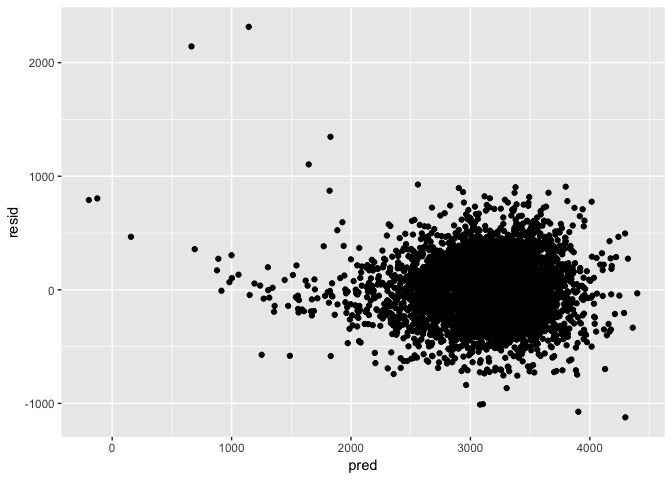

p8105\_hw6\_hn2339
================
Haowei Ni
2018/11/18

``` r
library(tidyverse)
```

    ## ─ Attaching packages ──────────────────────── tidyverse 1.2.1 ─

    ## ✔ ggplot2 3.0.0     ✔ purrr   0.2.5
    ## ✔ tibble  1.4.2     ✔ dplyr   0.7.8
    ## ✔ tidyr   0.8.1     ✔ stringr 1.3.1
    ## ✔ readr   1.1.1     ✔ forcats 0.3.0

    ## ─ Conflicts ────────────────────────── tidyverse_conflicts() ─
    ## ✖ dplyr::filter() masks stats::filter()
    ## ✖ dplyr::lag()    masks stats::lag()

``` r
library(dplyr)
library(stringr)
library(readr)
library(leaps)
library(modelr)
library(mgcv)
```

    ## Loading required package: nlme

    ## 
    ## Attaching package: 'nlme'

    ## The following object is masked from 'package:dplyr':
    ## 
    ##     collapse

    ## This is mgcv 1.8-25. For overview type 'help("mgcv-package")'.

``` r
library(broom)
```

    ## 
    ## Attaching package: 'broom'

    ## The following object is masked from 'package:modelr':
    ## 
    ##     bootstrap

Question 1
----------

``` r
library(readr)
homicide = read_csv("data/homicide-data.csv") %>% 
  janitor::clean_names()
```

    ## Parsed with column specification:
    ## cols(
    ##   uid = col_character(),
    ##   reported_date = col_integer(),
    ##   victim_last = col_character(),
    ##   victim_first = col_character(),
    ##   victim_race = col_character(),
    ##   victim_age = col_character(),
    ##   victim_sex = col_character(),
    ##   city = col_character(),
    ##   state = col_character(),
    ##   lat = col_double(),
    ##   lon = col_double(),
    ##   disposition = col_character()
    ## )

Create a city\_state variable and a binary variable

``` r
homicide = 
  homicide %>% 
  mutate(city_state = str_c(city, state, sep = "_"),  
         resolved = as.numeric(disposition == "Closed by arrest"))
```

Omit city Dallas, TX; Phoenix, AZ; and Kansas City, MO and Tulsa, AL

``` r
homicide = 
  homicide %>% 
  filter(!(city_state == "Dallas_TX" | city_state == "Phoenix_AZ" | city_state == "Kansas City_MO" | city_state == "Tulsa_AL")) %>% 
  mutate(victim_race = fct_relevel(ifelse(victim_race == "White", "white", "non-white"), "white"))
```

Modifiy victim\_race, and make victim\_age numeric

``` r
homicide = 
  homicide %>%
  mutate(victim_age = as.numeric(victim_age),
         victim_race = fct_relevel(victim_race, "White"))
```

    ## Warning in evalq(as.numeric(victim_age), <environment>): 强制改变过程中产生
    ## 了NA

    ## Warning: Unknown levels in `f`: White

fit a logistic regression

``` r
baltimore_df = 
  homicide %>% 
  filter(city == "Baltimore")
```

``` r
fit_logistic = 
  baltimore_df %>% 
  glm(resolved ~ victim_age + victim_race + victim_sex, data = ., family = binomial())
```

obtain the estimate and confidence interval of the adjusted odds ratio

``` r
fit_logistic %>% 
  broom::tidy() %>% 
  mutate(OR = exp(estimate), # transform back
         lower_bound = exp(estimate - std.error*1.96),
         upper_bound = exp(estimate + std.error*1.96)) %>%
  select(term, log_OR = estimate, OR, lower_bound, upper_bound, p.value) %>% 
  knitr::kable(digits = 3)
```

| term                  |  log\_OR|     OR|  lower\_bound|  upper\_bound|  p.value|
|:----------------------|--------:|------:|-------------:|-------------:|--------:|
| (Intercept)           |    1.186|  3.274|         2.067|         5.186|    0.000|
| victim\_age           |   -0.007|  0.993|         0.987|         0.999|    0.032|
| victim\_racenon-white |   -0.820|  0.441|         0.313|         0.620|    0.000|
| victim\_sexMale       |   -0.888|  0.412|         0.315|         0.537|    0.000|

the odds ratio estimate is 0.441 and 95% CI is (0.313, 0.620)

``` r
homicide_all =
  homicide %>% 
  group_by(city_state) %>% 
  nest()
OR_plot =
  homicide_all %>% 
  mutate(models = map(data, ~glm(resolved ~ victim_age + victim_sex + victim_race, data = .x, family = binomial())),
    models = map(models, broom::tidy)) %>% 
  select(-data) %>% 
  unnest() %>% 
  filter(term == "victim_racenon-white") %>% 
  mutate(OR = exp(estimate),
         lower_bound = exp(estimate - std.error*1.96),
         upper_bound = exp(estimate + std.error*1.96)) 
```

``` r
OR_plot %>% 
  mutate(city_state = fct_reorder(city_state, OR)) %>% 
  ggplot(aes(x = city_state, y = OR)) + 
  geom_point() + 
  geom_errorbar(aes(ymin = lower_bound, ymax = upper_bound)) +
  theme_bw() +
  theme(legend.position = "bottom",
        legend.direction = "horizontal",
        axis.text.x = element_text(angle = 90, size = 8),
        legend.key.size = unit(0.05, "cm"))
```


From this plot, we can see that Boston\_MA has the lowest OR means that the non-white people's case and the white people's case are the same level difficulty to resolve.Tampa\_FL has the highest OR means that non-white people's cases are much in the same solving rate as the white people. There are no much difference. Some cities have large error bar means that the there are much influction in the rate of solving the cases.

Question 2
----------

load and clean data.

``` r
birthweight = read_csv("data/birthweight.csv") %>% 
  mutate(mrace = as.factor(mrace),
         frace = as.factor(frace),
         babysex = as.factor(babysex),
         malform = as.factor(malform))
```

    ## Parsed with column specification:
    ## cols(
    ##   .default = col_integer(),
    ##   gaweeks = col_double(),
    ##   ppbmi = col_double(),
    ##   smoken = col_double()
    ## )

    ## See spec(...) for full column specifications.

In order to find the best fitted model, we need to compare the adjusted R^2. We can use the "lm.regsubsets" function.

``` r
model = regsubsets(bwt ~ ., data = birthweight)
```

    ## Warning in leaps.setup(x, y, wt = wt, nbest = nbest, nvmax = nvmax,
    ## force.in = force.in, : 3 linear dependencies found

    ## Reordering variables and trying again:

``` r
summary(model)
```

    ## Subset selection object
    ## Call: regsubsets.formula(bwt ~ ., data = birthweight)
    ## 24 Variables  (and intercept)
    ##          Forced in Forced out
    ## babysex2     FALSE      FALSE
    ## bhead        FALSE      FALSE
    ## blength      FALSE      FALSE
    ## delwt        FALSE      FALSE
    ## fincome      FALSE      FALSE
    ## frace2       FALSE      FALSE
    ## frace3       FALSE      FALSE
    ## frace4       FALSE      FALSE
    ## frace8       FALSE      FALSE
    ## gaweeks      FALSE      FALSE
    ## malform1     FALSE      FALSE
    ## menarche     FALSE      FALSE
    ## mheight      FALSE      FALSE
    ## momage       FALSE      FALSE
    ## mrace2       FALSE      FALSE
    ## mrace3       FALSE      FALSE
    ## mrace4       FALSE      FALSE
    ## parity       FALSE      FALSE
    ## ppbmi        FALSE      FALSE
    ## ppwt         FALSE      FALSE
    ## smoken       FALSE      FALSE
    ## pnumlbw      FALSE      FALSE
    ## pnumsga      FALSE      FALSE
    ## wtgain       FALSE      FALSE
    ## 1 subsets of each size up to 9
    ## Selection Algorithm: exhaustive
    ##          babysex2 bhead blength delwt fincome frace2 frace3 frace4 frace8
    ## 1  ( 1 ) " "      "*"   " "     " "   " "     " "    " "    " "    " "   
    ## 2  ( 1 ) " "      "*"   "*"     " "   " "     " "    " "    " "    " "   
    ## 3  ( 1 ) " "      "*"   "*"     " "   " "     " "    " "    " "    " "   
    ## 4  ( 1 ) " "      "*"   "*"     "*"   " "     " "    " "    " "    " "   
    ## 5  ( 1 ) " "      "*"   "*"     "*"   " "     " "    " "    " "    " "   
    ## 6  ( 1 ) " "      "*"   "*"     "*"   " "     " "    " "    " "    " "   
    ## 7  ( 1 ) " "      "*"   "*"     "*"   " "     " "    " "    " "    " "   
    ## 8  ( 1 ) " "      "*"   "*"     "*"   " "     " "    " "    "*"    " "   
    ## 9  ( 1 ) "*"      "*"   "*"     "*"   " "     " "    " "    "*"    " "   
    ##          gaweeks malform1 menarche mheight momage mrace2 mrace3 mrace4
    ## 1  ( 1 ) " "     " "      " "      " "     " "    " "    " "    " "   
    ## 2  ( 1 ) " "     " "      " "      " "     " "    " "    " "    " "   
    ## 3  ( 1 ) " "     " "      " "      " "     " "    "*"    " "    " "   
    ## 4  ( 1 ) " "     " "      " "      " "     " "    "*"    " "    " "   
    ## 5  ( 1 ) "*"     " "      " "      " "     " "    "*"    " "    " "   
    ## 6  ( 1 ) "*"     " "      " "      " "     " "    "*"    " "    " "   
    ## 7  ( 1 ) "*"     " "      " "      " "     " "    "*"    " "    " "   
    ## 8  ( 1 ) "*"     " "      " "      " "     " "    "*"    " "    " "   
    ## 9  ( 1 ) "*"     " "      " "      " "     " "    "*"    " "    " "   
    ##          parity pnumlbw pnumsga ppbmi ppwt smoken wtgain
    ## 1  ( 1 ) " "    " "     " "     " "   " "  " "    " "   
    ## 2  ( 1 ) " "    " "     " "     " "   " "  " "    " "   
    ## 3  ( 1 ) " "    " "     " "     " "   " "  " "    " "   
    ## 4  ( 1 ) " "    " "     " "     " "   " "  " "    " "   
    ## 5  ( 1 ) " "    " "     " "     " "   " "  " "    " "   
    ## 6  ( 1 ) " "    " "     " "     " "   " "  "*"    " "   
    ## 7  ( 1 ) " "    " "     " "     "*"   " "  "*"    " "   
    ## 8  ( 1 ) " "    " "     " "     "*"   " "  "*"    " "   
    ## 9  ( 1 ) " "    " "     " "     "*"   " "  "*"    " "

The '\*' means that correlation is significant, so we need to include this variable in the model. So for the best fitted model, we choose 'bhead', 'blength', 'delwt', 'frace4', 'gaweeks', 'mrace2', 'ppbmi', 'smoken'.

``` r
best_fit = lm(bwt ~ bhead + blength + delwt + frace + gaweeks + mrace + ppbmi + smoken,
               data = birthweight)
summary(best_fit)
```

    ## 
    ## Call:
    ## lm(formula = bwt ~ bhead + blength + delwt + frace + gaweeks + 
    ##     mrace + ppbmi + smoken, data = birthweight)
    ## 
    ## Residuals:
    ##      Min       1Q   Median       3Q      Max 
    ## -1122.52  -178.74    -3.39   172.38  2315.42 
    ## 
    ## Coefficients:
    ##               Estimate Std. Error t value Pr(>|t|)    
    ## (Intercept) -5598.8652    99.6407 -56.191  < 2e-16 ***
    ## bhead         129.5902     3.4109  37.993  < 2e-16 ***
    ## blength        74.6141     2.0220  36.901  < 2e-16 ***
    ## delwt           3.6484     0.2849  12.804  < 2e-16 ***
    ## frace2          7.3281    46.1628   0.159 0.873878    
    ## frace3         17.3581    69.3833   0.250 0.802462    
    ## frace4        -51.5829    44.7179  -1.154 0.248761    
    ## frace8          0.7445    74.1218   0.010 0.991986    
    ## gaweeks        12.0099     1.4512   8.276  < 2e-16 ***
    ## mrace2       -152.3814    46.0814  -3.307 0.000951 ***
    ## mrace3        -94.6175    71.9210  -1.316 0.188387    
    ## mrace4        -53.3093    45.0970  -1.182 0.237230    
    ## ppbmi         -12.6587     1.9203  -6.592 4.86e-11 ***
    ## smoken         -5.0069     0.5870  -8.529  < 2e-16 ***
    ## ---
    ## Signif. codes:  0 '***' 0.001 '**' 0.01 '*' 0.05 '.' 0.1 ' ' 1
    ## 
    ## Residual standard error: 273 on 4328 degrees of freedom
    ## Multiple R-squared:  0.7166, Adjusted R-squared:  0.7158 
    ## F-statistic:   842 on 13 and 4328 DF,  p-value: < 2.2e-16

Make two other models

``` r
lin_model1 = lm(bwt ~ blength + gaweeks, data = birthweight)
summary(lin_model1)
```

    ## 
    ## Call:
    ## lm(formula = bwt ~ blength + gaweeks, data = birthweight)
    ## 
    ## Residuals:
    ##     Min      1Q  Median      3Q     Max 
    ## -1709.6  -215.4   -11.4   208.2  4188.8 
    ## 
    ## Coefficients:
    ##              Estimate Std. Error t value Pr(>|t|)    
    ## (Intercept) -4347.667     97.958  -44.38   <2e-16 ***
    ## blength       128.556      1.990   64.60   <2e-16 ***
    ## gaweeks        27.047      1.718   15.74   <2e-16 ***
    ## ---
    ## Signif. codes:  0 '***' 0.001 '**' 0.01 '*' 0.05 '.' 0.1 ' ' 1
    ## 
    ## Residual standard error: 333.2 on 4339 degrees of freedom
    ## Multiple R-squared:  0.5769, Adjusted R-squared:  0.5767 
    ## F-statistic:  2958 on 2 and 4339 DF,  p-value: < 2.2e-16

``` r
lin_model2 = lm(bwt ~ bhead + blength + babysex + bhead * blength * babysex, data = birthweight)
summary(lin_model2)
```

    ## 
    ## Call:
    ## lm(formula = bwt ~ bhead + blength + babysex + bhead * blength * 
    ##     babysex, data = birthweight)
    ## 
    ## Residuals:
    ##      Min       1Q   Median       3Q      Max 
    ## -1132.99  -190.42   -10.33   178.63  2617.96 
    ## 
    ## Coefficients:
    ##                          Estimate Std. Error t value Pr(>|t|)    
    ## (Intercept)            -7176.8170  1264.8397  -5.674 1.49e-08 ***
    ## bhead                    181.7956    38.0542   4.777 1.84e-06 ***
    ## blength                  102.1269    26.2118   3.896 9.92e-05 ***
    ## babysex2                6374.8684  1677.7669   3.800 0.000147 ***
    ## bhead:blength             -0.5536     0.7802  -0.710 0.478012    
    ## bhead:babysex2          -198.3932    51.0917  -3.883 0.000105 ***
    ## blength:babysex2        -123.7729    35.1185  -3.524 0.000429 ***
    ## bhead:blength:babysex2     3.8781     1.0566   3.670 0.000245 ***
    ## ---
    ## Signif. codes:  0 '***' 0.001 '**' 0.01 '*' 0.05 '.' 0.1 ' ' 1
    ## 
    ## Residual standard error: 287.7 on 4334 degrees of freedom
    ## Multiple R-squared:  0.6849, Adjusted R-squared:  0.6844 
    ## F-statistic:  1346 on 7 and 4334 DF,  p-value: < 2.2e-16

The multiple R^2 for the 'best\_fit' linear regression is 0.7166, the multiple R^2 for the other two is 0.5769 and 0.6849, so the model we choose is better.

``` r
birthweight %>% 
  add_residuals(best_fit) %>% 
  add_predictions(best_fit) %>% 
  ggplot(aes(x = pred, y = resid)) + geom_point()
```


